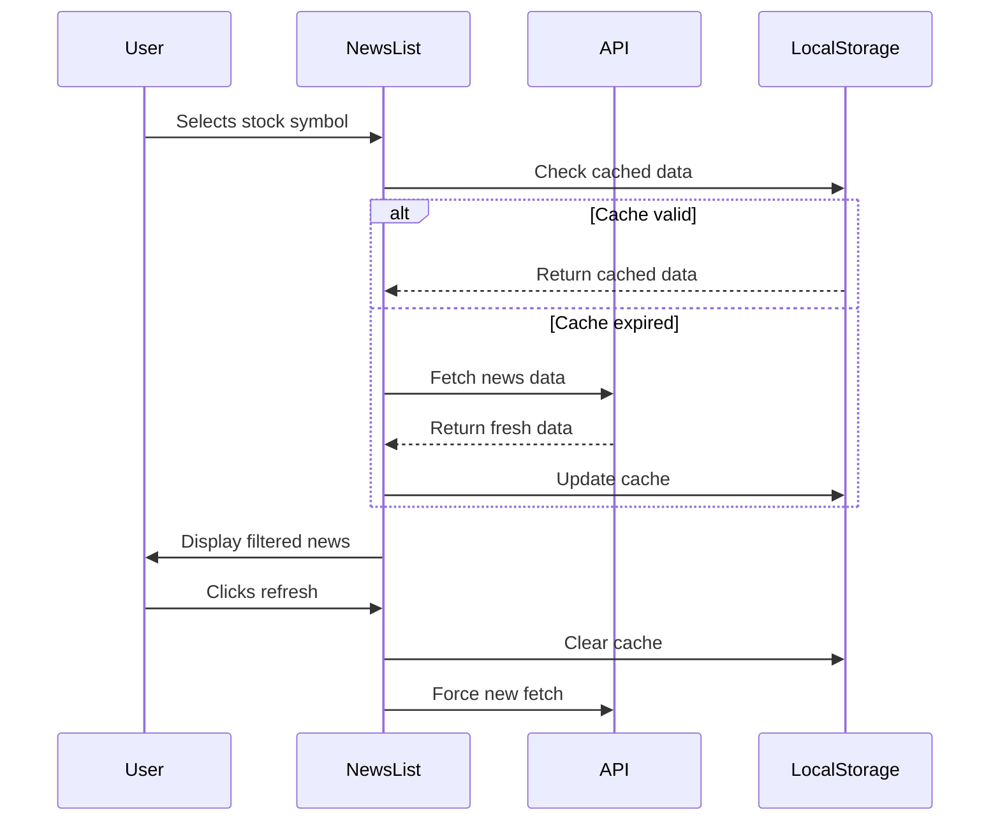

# Sentiment-Driven Stock Price Prediction Using News Headlines 📈

## **Overview** 🔍
This project provides a **real-time stock sentiment analysis platform** that predicts stock price movements using NLP-driven sentiment analysis of financial news. It features **automated data pipelines**, **machine learning integration**, and an **interactive dashboard** for market insights. The system is designed to help investors make data-driven decisions by analyzing the sentiment of news headlines and correlating it with stock price movements.

---


## **Key Features** 🚀

### **1. Automated News Aggregation**
- **Multi-Source Integration**: Fetches news from Alpha Vantage, Yahoo Finance, and Finnhub.
- **Scheduled Fetching**: Celery-powered tasks run every 15 minutes.
- **Duplicate Prevention**: Uses SHA-256 hashing to avoid duplicate articles.

### **2. Advanced Sentiment Analysis**
- **Real-Time Confidence Scoring**: Provides a confidence score (0-1) for each sentiment prediction.
- **Contextual Sentiment Classification**: Uses FinBERT for accurate sentiment analysis.
- **Historical Trend Visualization**: Displays sentiment trends over time.

### **3. Predictive Dashboard**
- **Interactive Charts**: Candlestick charts with sentiment overlay.
- **Source Distribution Heatmaps**: Visualizes news sources and their sentiment distribution.
- **Confidence-Level Indicators**: Highlights high-confidence predictions.
- **Mobile-Responsive Design**: Works seamlessly on all devices.

### **4. Enterprise-Grade Infrastructure**
- **Redis-Backed Task Queue**: Ensures reliable task processing.
- **Dockerized Deployment**: Easy setup and scaling.
- **Bulk Database Operations**: Optimized for performance.
- **API Rate Limit Handling**: Prevents API abuse.

---
## **System Architecture** 🏗️

### **Data Flow Diagram**

## Celery Task Scheduler
```
+------------------------------------------------+
|              Celery Beat Scheduler             |
|------------------------------------------------|
|  - Schedules fetch_news_for_all_symbols task   |
|  - Schedules periodic tasks for news processing|
+-----------------------+------------------------+
                        │
                        ▼
         +-------------------------------+
         |  fetch_news_for_all_symbols   |
         |-------------------------------|
         |  Query StockSymbol table to   |
         |  get list of symbols          |
         |  For each symbol:             |
         |    call fetch_and_process_news|
         +-------------------------------+
                        │
                        ▼
    +------------------------------------------+
    |  fetch_and_process_news (Celery Task)    |
    |------------------------------------------|
    | For a given symbol (e.g., IBM):          |
    | 1. Try Alpha Vantage; if fails, fallback |
    |    to Yahoo Finance, then Finnhub        |
    | 2. Fetch articles (filter for latest news|
    |    if fetch_latest_only==True)           |
    | 3. Process articles:                     |
    |    - Analyze sentiment using FinBERT     |
    |    - Compute title_hash                  |
    |    - Use bulk_create with unique_fields  |
    +------------------------------------------+
                        │
                        ▼
      +-------------------------------------+
      |        Database (ProcessedNews)     |
      |  - Stores processed articles        |
      |  - Ensures uniqueness on title_hash |
      |    and symbol                       |
      +-------------------------------------+
                        │
                        ▼
         +------------------------------+
         |         API Endpoints       |
         |------------------------------|
         | /api/news/symbol-search/     |
         | /api/news/analyzed/          |
         | /api/news/get-news/          |
         +------------------------------+
                        │
                        ▼
         +------------------------------+
         |        Frontend UI           |
         |------------------------------|
         |  Header.jsx (Symbol search)  |
         |  NewsAnalysis.jsx (Display   |
         |    processed news)           |
         |  PredictionHistory.jsx (Show |
         |    prediction history)       |
         +------------------------------+
                        │
                        ▼
         +------------------------------+
         | CSV File for Training Model  |
         |------------------------------|
         | - Contains Symbol, OHCLV,    |
         |   News, Sentiment, etc.      |
         | - Used to train a price      |
         |   prediction model           |
         +------------------------------+

```
## API Endpoints 🌐

1. Symbol Search
Search for stock symbols using Alpha Vantage or Yahoo Finance as fallback.

Endpoint:
``` http
GET /api/news/symbol-search/?q=Apple
```
Parameters:
- *q (required): The search query (e.g., "Apple")*
Response:
```json
{
  "results": [
    {
      "symbol": "AAPL",
      "name": "Apple Inc.",
      "exchange": "NASDAQ"
    }
  ]
}
```
2. Get Analyzed News
Retrieve analyzed news for a stock symbol. Steps:

    1. Check the database cache.
    2. Attempt to fetch from Alpha Vantage.
    3. Fallback to Finnhub, then Yahoo Finance if needed.
    4. Standardize and analyze each article, save it, and return the data.

Endpoint:
```http
GET /api/news/analyzed/?format=api
```
Parameters:
- ```symbol``` (required): The stock symbol (e.g., "AAPL").
- ```refresh``` (optional): Force a refresh of the data (default: ```false```).

Response:
```json
{
  "symbol": "AAPL",
  "news": [
    {
      "title": "Apple stock surges on strong earnings",
      "summary": "Apple reported record-breaking earnings...",
      "source": "Reuters",
      "published_at": "2024-01-07T12:00:00Z",
      "sentiment": "positive",
      "confidence": 0.85,
      "url": "https://example.com/apple-earnings"
    }
  ]
}
```
3. Get News
Retrieve processed news for a given stock symbol. If a refresh is requested or no processed news exists, trigger an asynchronous task.

Endpoint:

```http
GET /api/news/get-news/
```
Parameters:
- ```symbol``` (required): The stock symbol (e.g., "AAPL").
- ```refresh``` (optional): Force a refresh of the data (default: ```false```).

Response:
```json
{
  "status": "success",
  "symbol": "AAPL",
  "articles": [
    {
      "title": "Apple announces new product line",
      "summary": "Apple unveiled its latest product...",
      "source": "Bloomberg",
      "published_at": "2024-01-07T10:00:00Z",
      "sentiment": "neutral",
      "confidence": 0.72,
      "url": "https://example.com/apple-new-product"
    }
  ]
}
```
## Installation (Manual Setup) ⚙️
Backend:
```bash
python -m venv .venv
source .venv/bin/activate
pip install -r requirements.txt
```
Frontend:
```bash
cd frontend
npm install
npm run build
```
Start Services:
```bash
redis-server &
celery -A stock_sentiment_engine worker -l INFO &
python manage.py runserver
```
Environment Variables (.env)
```
NEWS_API_KEY=your_key
ALPHA_VANTAGE_KEY=your_key
FINNHUB_KEY=your_key
REDIS_URL=redis://localhost:6379/0
CELERY_BROKER=redis://localhost:6379/1
```
## Contributing

Contributions are always welcome!

See `contributing.md` for ways to get started.

Please adhere to this project's `code of conduct`.

```
1. Fork repository.
2. Create feature branch.
3. Submit PR with:
     - Test coverage.
     - Updated documentation.
     - Type annotations.
```
## License 📄

MIT License - See [LICENSE](https://choosealicense.com/licenses/mit/)for details.
