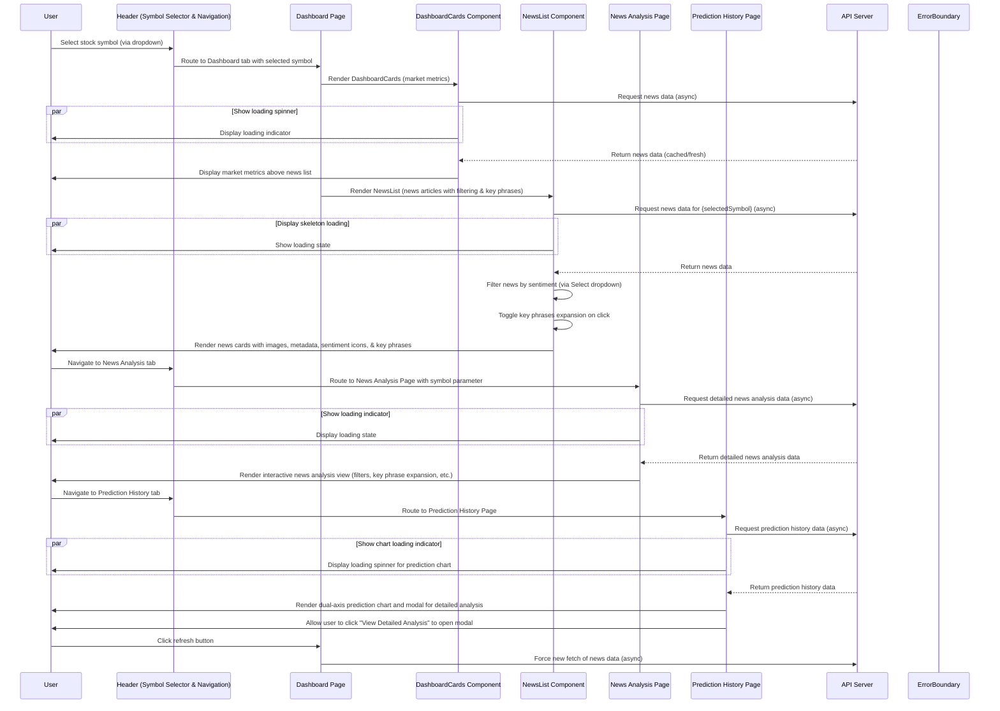
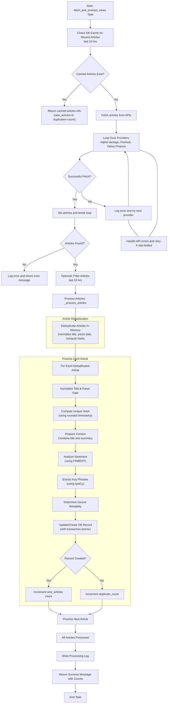
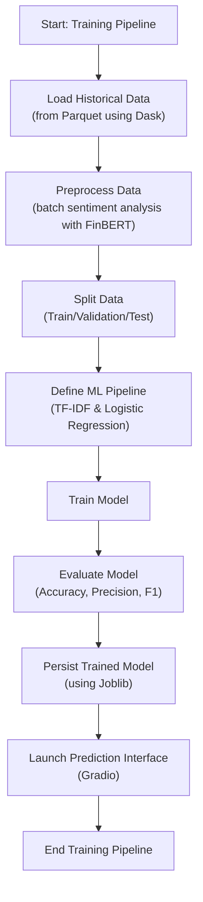
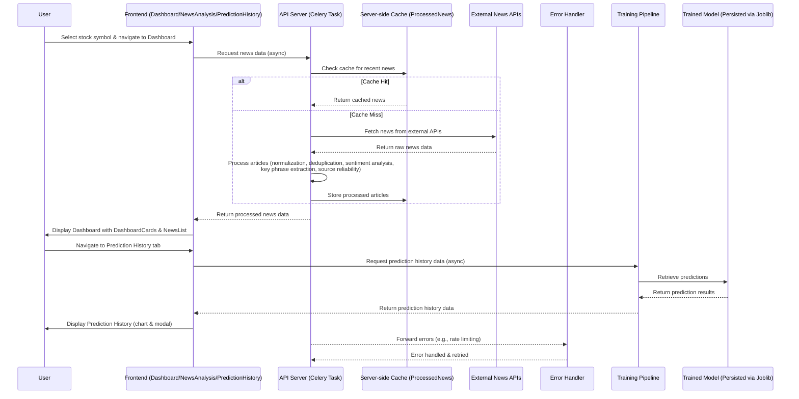

# Sentiment-Driven Stock Price Prediction Using News Headlines 📈


## **Overview** 🔍
This project delivers a real-time stock sentiment analysis platform that leverages cutting-edge NLP and machine learning to predict stock price movements based on financial news headlines. It features automated, multi-source data pipelines that aggregate and deduplicate news from sources like Alpha Vantage, Yahoo Finance, and Finnhub. The system employs advanced sentiment analysis using FinBERT and spaCy to extract key insights, which are then integrated into an interactive dashboard for market monitoring. Designed to empower investors, the platform provides actionable, data-driven insights by correlating news sentiment with stock price trends—enabling smarter, more informed decision-making.

---


## **Key Features** 🚀

### **1. Automated News Aggregation & Processing**
- **Multi-Source Integration**: Seamlessly aggregates news from Alpha Vantage, Yahoo Finance, and Finnhub to ensure comprehensive market coverage.
- **Duplicate Detection**: Employs SHA-256 hashing for robust duplicate prevention, ensuring only unique articles are processed and stored.
- **Dynamic Filtering**: Enables filtering of news by publication date, sentiment, and source reliability to provide the most relevant insights.

### **2. Advanced Sentiment & Contextual Analysis**
- **FinBERT-Powered Sentiment Analysis**: Leverages FinBERT for accurate, context-aware sentiment classification, capturing the nuances of market sentiment.
- **Real-Time Confidence Scoring**: Provides a confidence score (ranging from 0 to 1) with every sentiment prediction, empowering users to gauge prediction reliability.
- **Key Phrase Extraction**: Uses spaCy to extract critical key phrases from news content, aiding quick content digestion and context understanding.
- **Historical Trend Visualization**: Visualizes sentiment trends over time to help track market mood shifts and forecast potential movements.

### **3. Interactive Predictive Dashboard**
- **Unified Dashboard Interface**: Combines market metrics, news analysis, and prediction history in one interactive view.
- **Dynamic Data Visualizations**: Features interactive charts (including dual-axis graphs) with sentiment overlays and trend analyses.
- **Custom Filtering & Real-Time Refresh**: Allows users to apply custom filters on news and refresh data dynamically to get the latest market insights.
- **Confidence & Reliability Indicators**: Highlights prediction confidence levels and news source reliability, ensuring informed decision-making.

### **4. Robust Enterprise-Grade Infrastructure**
- **Asynchronous Task Management**: Powered by Django and Celery for efficient, reliable background processing of news data and machine learning tasks.
- **Redis-Backed Task Queue & Bulk Database Operations**: Optimized for high-throughput operations, handling API rate limits, and ensuring performance via server-side caching.
- **Dockerized Deployment**: Facilitates easy setup, scaling, and consistent deployment across environments.

### **5. Training & Prediction Pipeline**
- **Efficient Data Ingestion & Preprocessing**: Utilizes Dask for memory-efficient data ingestion from Parquet files, ensuring scalable processing of historical news data.
- **Automated Model Training**: Trains a scikit-learn pipeline (featuring TF-IDF vectorization and Logistic Regression) to predict stock movements, complete with detailed performance evaluations (accuracy, precision, F1 score).
- **Model Persistence & Interactive Predictions**: Persists the trained model using Joblib and offers an interactive Gradio interface for real-time stock movement predictions.

### **6. Future Enhancements: AI-Driven Market Overviews**
- **Upcoming AI Overviews**: Planned integration of AI-generated summaries to provide market overviews and actionable insights, further enhancing the decision-making process by summarizing complex news narratives.

---
## **System Architecture** 🏗️
## Frontend Architecture
This section covers the user interface components built with React. The frontend is designed with a dashboard that displays market metrics (DashboardCards), a news analysis module (NewsAnalysis) that filters and presents news articles with key phrases and sentiment badges, and a prediction history component that visualizes past predictions. Routing and error handling are managed using React Router, React Query, and custom UI components.
### **Data Flow Diagram**

## Backend Architecture
The backend is powered by Django and Celery for asynchronous tasks. It fetches news data from external APIs (Alpha Vantage, Finnhub, Yahoo Finance), processes the articles (normalization, deduplication, sentiment analysis, key phrase extraction, and source reliability assessment), and stores the results in a server‑side cache (Django DB). Robust error handling and retry mechanisms ensure the system’s resilience.


## Training & Prediction Pipeline
This section details the machine learning pipeline that processes historical news data for training. It uses Dask for efficient data ingestion from Parquet files, performs batch sentiment analysis with FinBERT, and trains a scikit‑learn pipeline (utilizing TF‑IDF for feature extraction and Logistic Regression for classification) to predict stock movements. The trained model is persisted using Joblib and can be accessed via a Gradio interface for interactive predictions.

## Sequence Diagrams
This combined sequence diagram illustrates the end‑to‑end flow of the application. It details how the frontend components (Dashboard with DashboardCards and NewsList, News Analysis page, Prediction History page) interact with the backend API for news processing, and how the training pipeline feeds into the prediction endpoint. This overview helps visualize the complete system architecture and data flow.

## API Endpoints 🌐

### 1. Symbol Search
Search for stock symbols using Alpha Vantage or Yahoo Finance as fallback.

#### Endpoint:
``` http
GET /api/news/symbol-search/?q=Apple
```
#### Parameters:
- *q (required): The search query (e.g., "Apple")*
#### Response:
```json
HTTP 200 OK
Allow: OPTIONS, GET
Content-Type: application/json
Vary: Accept
[
    {
        "1. symbol": "APLE",
        "2. name": "Apple Hospitality REIT Inc",
        "3. type": "Equity",
        "4. region": "United States",
        "5. marketOpen": "09:30",
        "6. marketClose": "16:00",
        "7. timezone": "UTC-04",
        "8. currency": "USD",
        "9. matchScore": "0.8889"
    },
```
### 2. Get Analyzed News
Retrieve analyzed news for a stock symbol. Steps:

    1. Check the database cache.
    2. Attempt to fetch from Alpha Vantage.
    3. Fallback to Finnhub, then Yahoo Finance if needed.
    4. Standardize and analyze each article, save it, and return the data.

#### Endpoint:
```http
GET /api/news/analyzed/
```
#### Parameters:
- ```symbol``` (required): The stock symbol (e.g., "AAPL").
- ```refresh``` (optional): Force a refresh of the data (default: ```false```).

#### Response:
```json
HTTP 200 OK
Allow: OPTIONS, GET
Content-Type: application/json
Vary: Accept

{
    "symbol": "IBM",
    "news": [
        {
            "title": "Seagate Inks Deal to Acquire Intevac in $119 Million All-Cash Deal",
            "summary": "STX will buy Intevac for $4.00 per share in an all-cash transaction. The buyout is expected to close by late March or early April 2025.",
            "source": "Zacks Commentary",
            "published_at": "2025-02-14T14:56:00Z",
            "sentiment": "neutral",
            "confidence": 0.904671311378479
        },
```
### 3. Get News
Retrieve processed news for a given stock symbol. If a refresh is requested or no processed news exists, trigger an asynchronous task.

#### Endpoint:

```http
GET /api/news/get-news/
```
#### Parameters:
- ```symbol``` (required): The stock symbol (e.g., "AAPL").
- ```refresh``` (optional): Force a refresh of the data (default: ```false```).

#### Response:
```json
HTTP 200 OK
Allow: OPTIONS, GET
Content-Type: application/json
Vary: Accept

{
    "symbol": "IBM",
    "news": [
        {
            "title": "Seagate Inks Deal to Acquire Intevac in $119 Million All-Cash Deal",
            "summary": "STX will buy Intevac for $4.00 per share in an all-cash transaction. The buyout is expected to close by late March or early April 2025.",
            "source": "Zacks Commentary",
            "published_at": "2025-02-14T14:56:00Z",
            "sentiment": "neutral",
            "confidence": 0.904671311378479
        },
```
## Installation (Manual Setup) ⚙️
### Backend:
```bash
python -m venv .venv
source .venv/Scripts/activate
pip install -r requirements.txt

cd sentiment_driven_stock_price_prediction_engine
python manage.py runserver
```

### Frontend:
```bash
cd .venv
Scripts/activate

cd frontend
npm install
npm run dev
```

### Start Services:
```bash
redis-server
celery -A sentiment_driven_stock_price_prediction_engine worker --pool=solo --loglevel=info
python manage.py runserver
npm run dev
```

### Environment Variables (.env)
```
//Backend (.env)//

NEWS_API_KEY=
ALPHA_VANTAGE_KEY=
FINNHUB_API_KEY=
RAPIDAPI_KEY=
RAPIDAPI_HOST=
DB_NAME=stock_analysis
DB_USER=postgres
DB_PASSWORD=postgres
DB_HOST=localhost
CELERY_BROKER_URL=

//Frontend (.env)//

VITE_ALPHA_VANTAGE_KEY=
VITE_RAPIDAPI_KEY=
VITE_RAPIDAPI_HOST=
REACT_APP_API_BASE_URL=

```

## Contributing

We welcome contributions to improve this project! Follow these steps to get started:

1. **Fork the Repository:** Create your own copy of the project.
2. **Create a Feature Branch:** Branch off from the latest version of `main`.
3. **Implement Your Changes:** 
   - Add new features or bug fixes.
   - Include comprehensive test coverage.
   - Update the documentation as needed.
   - Ensure proper type annotations are added.
4. **Submit a Pull Request (PR):** Clearly describe your changes and the issues they address.

By contributing, you agree to adhere to our Code of Conduct to ensure a respectful and collaborative environment for everyone.

## License 📄

MIT License - See [LICENSE](https://choosealicense.com/licenses/mit/)for details.
