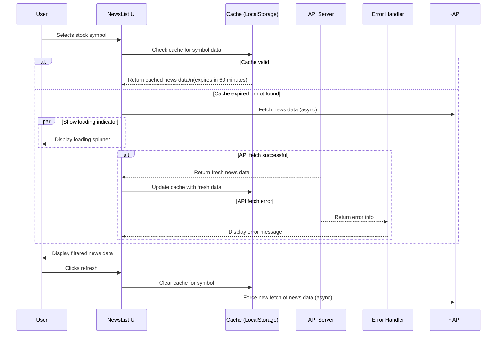
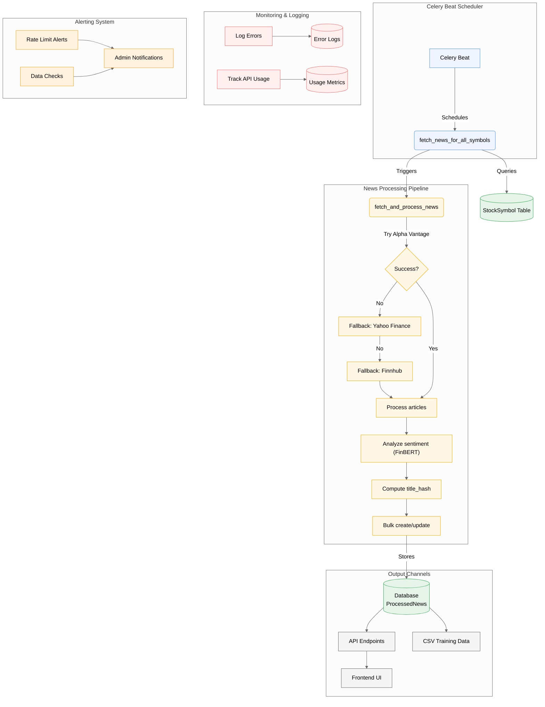

# Sentiment-Driven Stock Price Prediction Using News Headlines 📈

## **Overview** 🔍
This project provides a **real-time stock sentiment analysis platform** that predicts stock price movements using NLP-driven sentiment analysis of financial news. It features **automated data pipelines**, **machine learning integration**, and an **interactive dashboard** for market insights. The system is designed to help investors make data-driven decisions by analyzing the sentiment of news headlines and correlating it with stock price movements.

---


## **Key Features** 🚀

### **1. Automated News Aggregation**
- **Multi-Source Integration**: Fetches news from Alpha Vantage, Yahoo Finance, and Finnhub.
- **Scheduled Fetching**: Celery-powered tasks run every 4hours.
- **Duplicate Prevention**: Uses SHA-256 hashing to avoid duplicate articles.

### **2. Advanced Sentiment Analysis**
- **Real-Time Confidence Scoring**: Provides a confidence score (0-1) for each sentiment prediction.
- **Contextual Sentiment Classification**: Uses FinBERT for accurate sentiment analysis.
- **Historical Trend Visualization**: Displays sentiment trends over time.

### **3. Predictive Dashboard**
- **Interactive Charts**: Charts with sentiment overlay.
- **Source Distribution Heatmaps**: Visualizes news sources and their sentiment distribution.
- **Confidence-Level Indicators**: Highlights high-confidence predictions.

### **4. Enterprise-Grade Infrastructure**
- **Redis-Backed Task Queue**: Ensures reliable task processing.
- **Dockerized Deployment**: Easy setup and scaling.
- **Bulk Database Operations**: Optimized for performance.
- **API Rate Limit Handling**: Prevents API abuse.

---
## **System Architecture** 🏗️

### **Data Flow Diagram**

## Celery Task Scheduler


## API Endpoints 🌐

### 1. Symbol Search
Search for stock symbols using Alpha Vantage or Yahoo Finance as fallback.

#### Endpoint:
``` http
GET /api/news/symbol-search/?q=Apple
```
#### Parameters:
- *q (required): The search query (e.g., "Apple")*
#### Response:
```json
HTTP 200 OK
Allow: OPTIONS, GET
Content-Type: application/json
Vary: Accept
[
    {
        "1. symbol": "APLE",
        "2. name": "Apple Hospitality REIT Inc",
        "3. type": "Equity",
        "4. region": "United States",
        "5. marketOpen": "09:30",
        "6. marketClose": "16:00",
        "7. timezone": "UTC-04",
        "8. currency": "USD",
        "9. matchScore": "0.8889"
    },
```
### 2. Get Analyzed News
Retrieve analyzed news for a stock symbol. Steps:

    1. Check the database cache.
    2. Attempt to fetch from Alpha Vantage.
    3. Fallback to Finnhub, then Yahoo Finance if needed.
    4. Standardize and analyze each article, save it, and return the data.

#### Endpoint:
```http
GET /api/news/analyzed/?format=api
```
#### Parameters:
- ```symbol``` (required): The stock symbol (e.g., "AAPL").
- ```refresh``` (optional): Force a refresh of the data (default: ```false```).

#### Response:
```json
HTTP 200 OK
Allow: OPTIONS, GET
Content-Type: application/json
Vary: Accept

{
    "symbol": "IBM",
    "news": [
        {
            "title": "Seagate Inks Deal to Acquire Intevac in $119 Million All-Cash Deal",
            "summary": "STX will buy Intevac for $4.00 per share in an all-cash transaction. The buyout is expected to close by late March or early April 2025.",
            "source": "Zacks Commentary",
            "published_at": "2025-02-14T14:56:00Z",
            "sentiment": "neutral",
            "confidence": 0.904671311378479
        },
```
### 3. Get News
Retrieve processed news for a given stock symbol. If a refresh is requested or no processed news exists, trigger an asynchronous task.

#### Endpoint:

```http
GET /api/news/get-news/
```
#### Parameters:
- ```symbol``` (required): The stock symbol (e.g., "AAPL").
- ```refresh``` (optional): Force a refresh of the data (default: ```false```).

#### Response:
```json
HTTP 200 OK
Allow: OPTIONS, GET
Content-Type: application/json
Vary: Accept

{
    "symbol": "IBM",
    "news": [
        {
            "title": "Seagate Inks Deal to Acquire Intevac in $119 Million All-Cash Deal",
            "summary": "STX will buy Intevac for $4.00 per share in an all-cash transaction. The buyout is expected to close by late March or early April 2025.",
            "source": "Zacks Commentary",
            "published_at": "2025-02-14T14:56:00Z",
            "sentiment": "neutral",
            "confidence": 0.904671311378479
        },
```
## Installation (Manual Setup) ⚙️
### Backend:
```bash
python -m venv .venv
source .venv/Scripts/activate
pip install -r requirements.txt
```
### Frontend:
```bash
cd frontend
npm install
npm run dev
```
### Start Services:
```bash
redis-server
celery -A sentiment_driven_stock_price_prediction_engine worker --pool=solo --loglevel=info
python manage.py runserver
```
### Environment Variables (.env)
```
//Backend (.env)//

NEWS_API_KEY=
ALPHA_VANTAGE_KEY=
FINNHUB_API_KEY=
RAPIDAPI_KEY=
RAPIDAPI_HOST=
DB_NAME=stock_analysis
DB_USER=postgres
DB_PASSWORD=postgres
DB_HOST=localhost
CELERY_BROKER_URL=

//Frontend (.env)//

VITE_ALPHA_VANTAGE_KEY=
VITE_RAPIDAPI_KEY=
VITE_RAPIDAPI_HOST=
REACT_APP_API_BASE_URL=

```

## Contributing

Contributions are always welcome!

See `contributing.md` for ways to get started.

Please adhere to this project's `code of conduct`.

```
1. Fork repository.
2. Create feature branch.
3. Submit PR with:
     - Test coverage.
     - Updated documentation.
     - Type annotations.
```
## License 📄

MIT License - See [LICENSE](https://choosealicense.com/licenses/mit/)for details.
